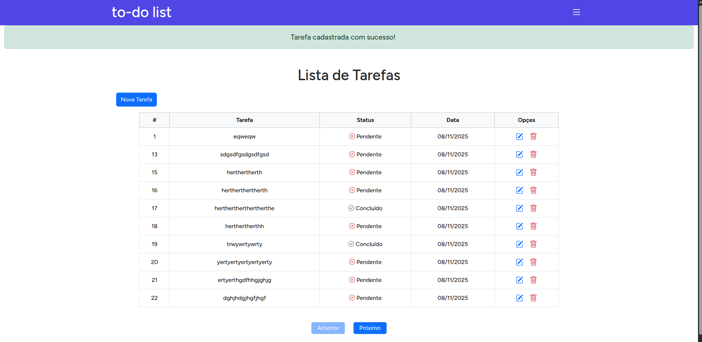

# 📝 To-do List Laravet + Vue.js



Este projeto é uma aplicação de gerenciamento de tarefas desenvolvida com Laravel (frontend via Blade), com ambiente configurado via Docker.

---
## Funcionalidades
- CRUD de Usuario
- CRUD de Tarefa
#### Funcionalidades bônus
- Barra de pesquisa, para localizar tarefas
- Nivel de permissão
    - Apenas o usuarios tem acesso a sua tarefas
#### Uso do Framework 
- **Relacionamentos:**
    - `Tarefa` pertence a `Status` (`$tarefa->status`)
    - `Tarefa` pertence a `User` (`$tarefa->user`)
- **Validetions [FormRequest]**
- **Migrations**
- **Seeders**
- **Soft delete:** tarefas excluídas são removidas logicamente e podem ser restauradas

## 🚀 Como rodar o projeto localmente

### 1. Clone o repositório

```bash
git clone https://github.com/martinss08/teste-estagio.git
cd teste-estagio
```

### 2. Instale as dependências do Laravel

```bash
composer install
```

## Copie o arquivo de exemplo e configure o banco de dados:
```
cp .env.example .env

* Abra .env e configure:

DB_CONNECTION=mysql
DB_HOST=127.0.0.1
DB_PORT=3306
DB_DATABASE=laravel
DB_USERNAME=root
DB_PASSWORD=root
```
## Gere a chave da aplicação

```
php artisan key:generate
```
## Execute as migrations (banco de dados)
```
php artisan migrate
php artisan db:seed
```
## Rode o projeto
```

php artisan serve
```


## 3. Acesse o projeto

Para acessar o projeto, acesse [http://127.0.0.1:8000](http://127.0.0.1:8000)

## 👤 Usuário padrão (seeded)

Após rodar o proejto, você poderá acessar com:

- **Email:** `admin@example.com`  
- **Senha:** `123456`

---

## 🐞 Comandos úteis

| Ação                          | Comando                                                  |
|-------------------------------|----------------------------------------------------------|
| Rodar o servidor local        | `php artisan serve`                                      |
| Rodar migrations              | `php artisan migrate`                                    |
| Rodar seeds                   | `php artisan db:seed`                                    | 

---

## 💡 Estrutura

- `app/` –  Lógica de negócio (Laravel)
- `resources/js/` – Scripts JS (Bootstrap ou outros)
- `routes/` – Arquivos de rotas (web.php, console.php, etc.)
- `database/` – Migrations, Seeders, Factories

---

## 📦 Tecnologias

- Laravel 10+
- Bootstrap 5
- MySQL 

---